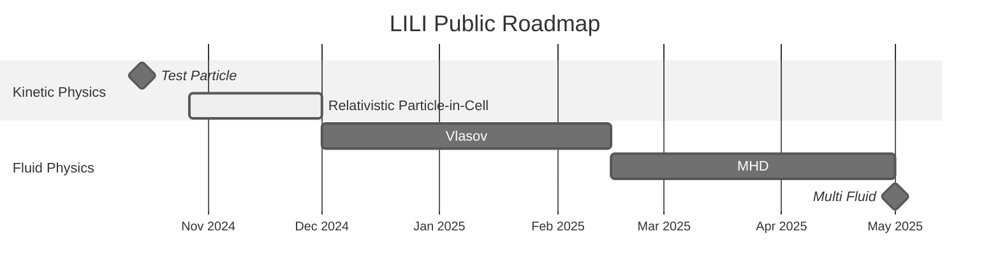

# LILI

F**L**uid-K**I**netic P**L**asma S**I**mulation Code

>[!NOTE]
> This code is still under early development and the API is subject to change. Current public version is about one milestone behind the development version.
>
> Please find check the [roadmap](#roadmap) for more information.

This code serves as a rapid prototyping platform for fluid and kinetic plasma simulations. The code is designed to be modular, allowing for easy implementation of new physics and numerical methods. Codes are well documented and easy to read, making it a great tool for testing purposes.

The code is written in C++ and is designed to be parallelizable using MPI. Most of the work is done on the scaffolding required to implement the physics and numerical methods.

The code is designed to be trivially vectorized and can be easily transformed into a GPU code.

## Installation

We use [**Spack**](https://github.com/spack/spack) to manage the dependencies and CMake to build the code.

To install the code, first clone the repository and then install the dependencies using Spack.

```bash
git clone git@github.com:himax16/lili.git
spack env activate lili/.
spack install
```

To build the code using CMake:

```bash
cmake -B lili/build -S lili
cmake --build lili/build
```

The executable will be in `lili/build/bin`.

## Roadmap



## Documentation

The source code is documented using [Doxygen](https://www.doxygen.nl/) and processed using [Breathe](https://breathe.readthedocs.io/) and [Exhale](https://exhale.readthedocs.io/) to generate [Sphinx](https://www.sphinx-doc.org/) documentation.

To build the documentation, use the following commands on the project root directory:

```bash
cmake -DBUILD_DOCS=ON -B build -S .
cmake --build build
```

The documentation will be in `build/docs/sphinx`.

### Future Major Milestones

* **Hybrid Physics**
  * Kinetic-Vlasov
  * Kinetic-MHD
  * Kinetic-RMHD
  * Collision Fluid Models

* **_GPU Rewrite_**

* **Multi-Physics Coupling**
