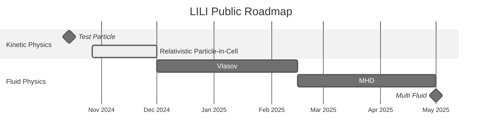

# LILI

F**L**uid-K**I**netic P**L**asma S**I**mulation Code

>[!NOTE]
> This code is still under early development and the API is subject to change. Current public version is about one milestone behind the development version.
>
> Please find check the [roadmap](#roadmap) for more information.

This code serves as a rapid prototyping platform for fluid and kinetic plasma simulations. The code is designed to be modular, allowing for easy implementation of new physics and numerical methods. Codes are well documented and easy to read, making it a great tool for testing purposes.

The code is written in C++ and is designed to be parallelizable using MPI. Most of the work is done on the scaffolding required to implement the physics and numerical methods.

The code is designed to be trivially vectorized and can be easily transformed into a GPU code.

## Installation

We use [**Spack**](https://github.com/spack/spack) to manage the dependencies and CMake to build the code.

To install the code, first clone the repository and then install the dependencies using Spack.

```bash
git clone git@github.com:himax16/lili.git
spack env activate lili/.
spack install
```

To build the code using CMake:

```bash
cmake -B lili/build -S lili
cmake --build lili/build
```

The executable will be in `lili/build/bin`.

## Roadmap



### Future Major Milestones

* **Hybrid Physics**
  * Kinetic-Vlasov
  * Kinetic-MHD
  * Kinetic-RMHD
  * Collision Fluid Models

* **_GPU Rewrite_**

* **Multi-Physics Coupling**

## Key features

* Multiscale capabilities through implementation of MHD, two fluids, hybrid, and PIC
* Modular and easy to use
* Vectorized
* Modern and optimized input/output
* Non-blocking calculations
* Data layout that can be easily transformed into a GPU code

## Assumptions

| Physical Quantities | Value |
| :- | :- |
| Speed of light | `c = 1` |
| Electron mass | `m_e = 1` |
| Electron charge | `e = -1` |

## Class note

### Mesh

* Mesh sizes are stored in `uint32_t` to be large enough but MPI friendly.

## Error codes

| Exit Code | Description |
| :- | :- |
| `1` | Parsing error |
| `2` | Input file error |
| `21` | Load Mesh error |

### Initialization

* `10`: Number of simulation system is not a positive integer
* `11`: Unrecognized simulation system
* `12`: Multiple MHD system

## Idea notes

1. Use array of function pointer for k-stage evolutions for all system variable
     * Make sure at the end of every stage there is MPI wait or something similar.
     * At each, stage the integrator can have multiple substage depending on order of accuracy.
     * Easy to change with function pointers. Need to probably define a variable.
     * Have composite function for example in the case of expanding box transition.
     * This way field can also just be mesh variable.
     * Issue might arise on how to keep the variable cache in place.
       * Try to rearrange process call, i.e. `(v1_1, v2_1, v3_1, v3_2, v2_2[null], v1_2[null], v3_3, v1_3, v2_3, v2_4, ...)`
       * Default option might just be cyclic with `(v1_1, ..., vn_1, vn_2, ..., v1_2, v1_3, ..., vn_3, vn_4, ...)`
2.

## TODO

### Docs

1. Add `exhale` for automatically moving from `Doxygen` to `breathe`
